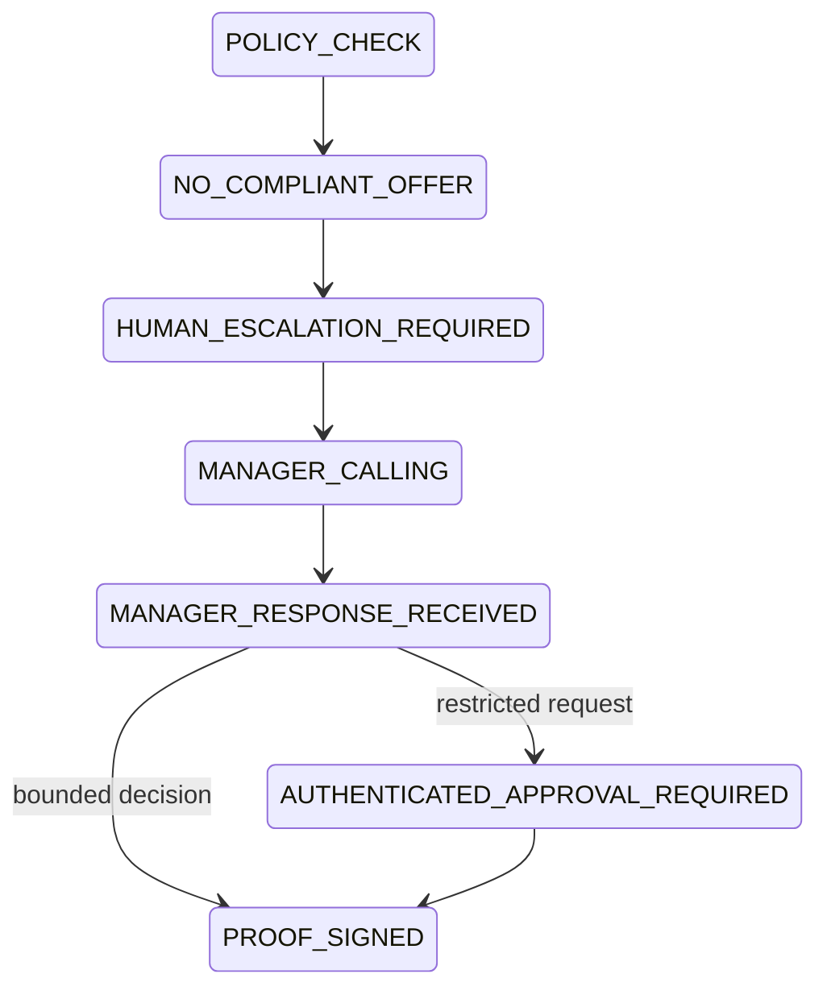
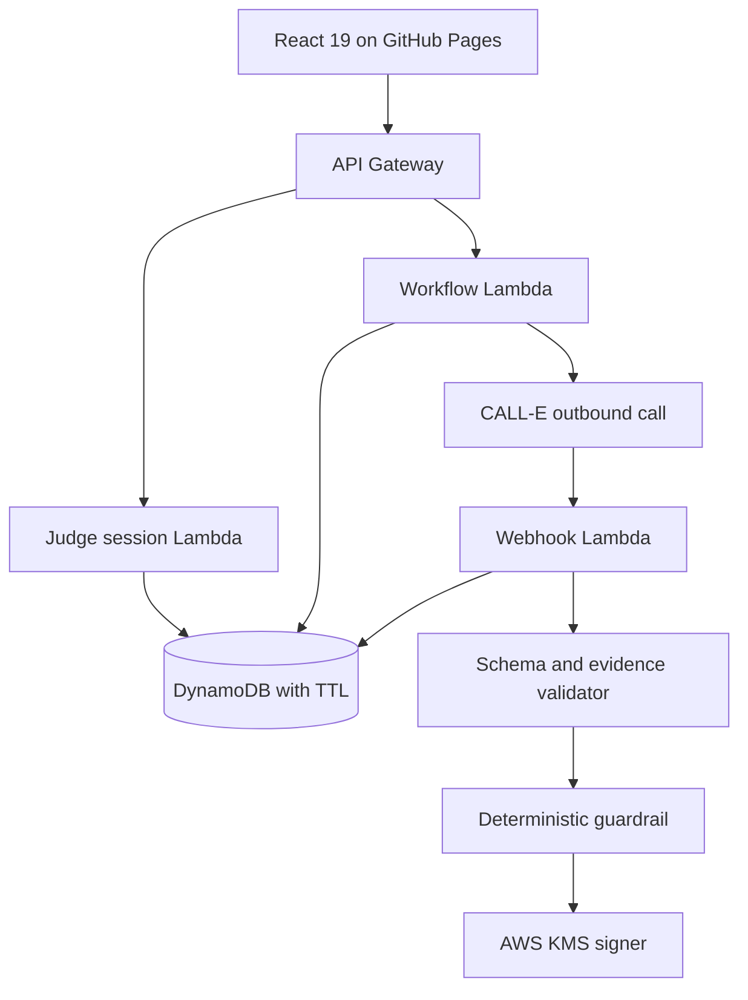

# Judge Mode — Manager Escalation

## Product decision

The primary live Judge Mode experience is a single, consented escalation call to the judge acting as a fictional duty procurement manager. Playing an approved supplier is a stretch feature, not the default experience.

The call is only available after the deterministic Policy Gateway rejects every supplier offer:

Every organization, material, supplier, offer and order in this experience is fictional or synthetic.

## Allowed voice decisions

| Spoken intent | Effective result | Side effect |
|---|---|---|
| Acknowledge and start human sourcing | `ACKNOWLEDGE_AND_START_HUMAN_SOURCING` | Record a bounded operational instruction |
| Retry approved suppliers later | `RETRY_APPROVED_SUPPLIERS_LATER` | Record a validated callback time; no automatic retry in the hackathon version |
| Request written report | `REQUEST_WRITTEN_REPORT` | Record the request; report delivery remains a backend stretch feature |
| Decline escalation or opt out | `DECLINE_ESCALATION` | Stop and suppress further contact for the session |
| Increase budget, bypass policy, approve an unknown supplier, accept changed legal terms or create a real order | `REQUIRES_AUTHENTICATED_HUMAN_APPROVAL` | Record only; require authenticated portal approval |

The model may interpret the conversation, but a deterministic guardrail computes the effective decision. A transcript summary alone is not trusted as evidence.

## Runtime boundaries

### Public mock preview

- runs entirely with synthetic phone tasks;
- requires no access code, phone number or external service;
- shows the no-compliant-offer path, structured result, evidence validation, state transitions and signed proof;
- labels the runtime as mock;
- cannot make a telephone call.

### Future live Judge Mode

- is unlocked by an access code checked only by the backend;
- creates a short-lived, one-call session;
- accepts an E.164 number only after explicit consent;
- starts one outbound CALL-E task through the backend;
- receives terminal CALL-E results through a verified webhook or controlled polling;
- updates the existing `runId` and signs the resulting proof;
- remains disabled unless the backend, credentials and global call switch are configured.

No valid access code, API credential or server-side authorization decision belongs in the React bundle.

## Backend API contract

| Endpoint | Purpose | Important controls |
|---|---|---|
| `POST /judge/sessions` | Verify the Devpost-only code and issue an opaque session | salted code hash, constant-time comparison, TTL, rate limit |
| `POST /judge/sessions/{sessionId}/manager-calls` | Record consent and create one CALL-E task | bearer session, country/number validation, conditional one-call claim, idempotency key, kill switch |
| `POST /webhooks/calle` | Accept a CALL-E event | provider authenticity check, event dedupe, schema validation, no trust in summary-only data |
| `GET /judge/runs/{runId}` | Return state for controlled UI polling | session-scoped authorization, redacted response |
| `DELETE /judge/sessions/{sessionId}` | Remove retained judge contact data early | session ownership, auditable deletion |

The TypeScript browser-to-backend contract is implemented in `src/server/judge`. Without a configured backend URL, it fails before transmitting the access code or number.

The framework-neutral backend core is implemented in `src/server/judge/backend`. The AWS-facing contracts in `src/server/judge/aws` wrap it without coupling the domain service to an AWS SDK and currently provide:

- PBKDF2-SHA256 access-code verification with a salted derived key supplied through a secret-store port;
- random opaque session tokens stored only as SHA-256 hashes;
- 15-minute session expiry and fixed-window authorization rate limiting;
- an atomic one-call session claim with idempotent duplicate handling;
- explicit consent, E.164 syntax and calling-code allowlisting;
- a global call budget and fail-closed kill switch;
- phone-number hashing instead of plaintext session persistence;
- fail-closed webhook authenticity, event deduplication and event-ID conflict detection;
- structured-result quarantine before workflow ingestion;
- API Gateway-compatible request/response handlers with no-store responses and
  safe error mapping;
- DynamoDB conditional-write commands for one-call claims, fixed-window rate
  limiting, the global call budget and persistent webhook deduplication;
- a Secrets Manager adapter that accepts only the expected PBKDF2-SHA256 secret
  schema and rejects plaintext or weak records.

Both in-memory test adapters and DynamoDB command adapters exist. The latter are tested against a fake document client so concurrency conditions remain explicit, but an AWS SDK client facade and deployed table are still required for live use. No AWS resource is created by this repository state.

## Proposed AWS deployment

The minimal deployment uses API Gateway, Lambda, DynamoDB and KMS. Step Functions is deferred until real CALL-E timing demonstrates that its retry and callback model materially simplifies the workflow.

Suggested DynamoDB records:

- `JudgeSession`: hashed opaque token, expiry, one-call counter, consent timestamp and redacted phone reference;
- `WorkflowRun`: current state, version and `runId`;
- `CallAttempt`: CALL-E task ID, idempotency key and terminal outcome;
- `WebhookEvent`: provider event ID used for conditional deduplication;
- `DecisionProof`: canonical payload, audit root, signature and KMS key ID.

The implemented Judge-session record uses a conditional create, DynamoDB TTL and
a consistent read before an atomic claim. The claim update checks the hashed
session token, active status, server-side expiry and idempotency key in one
condition, preventing two concurrent submissions from consuming two calls.
Webhook IDs use a conditional put; a repeated ID with the same body hash is a
duplicate, while the same ID with different content is treated as a conflict.
Only the phone hash is persisted in the session claim.

The access-code hash belongs in Secrets Manager or an equivalently protected backend secret. Phone numbers and transcripts receive minimal TTL retention, encryption at rest, redacted logs and an explicit deletion path.

## Evidence and proof

The manager decision is accepted only when:

1. the call reached an answered terminal state;
2. the structured result passes the explicit schema;
3. the decision field has verified transcript or recipient-result evidence;
4. the deterministic restricted-action guardrail has executed.

Decision Proof v2 contains nullable order fields and an optional manager escalation block. The escalation block stores hashes for the call identifier, structured response and evidence plus the raw and effective decision. The phone number is not included.

The record is a **cryptographically signed, machine-verifiable decision record with tamper-evident audit chaining**. It proves StockGuard record integrity and origin under the configured signer. It does not prove that the manager statement is true, establish strong caller identity, or provide a legal signature.

## Failure behavior

| Failure | Result |
|---|---|
| Invalid/expired code | No session and no call |
| Missing consent | No call |
| Duplicate submission | Existing idempotent task returned |
| Session already used | No second call |
| No answer or voicemail | `HUMAN_REVIEW`; no policy change and no order |
| Missing/invalid result schema | Quarantine response and require human review |
| Missing decision evidence | Quarantine response and require human review |
| Restricted spoken request | `REQUIRES_AUTHENTICATED_HUMAN_APPROVAL` |
| Duplicate webhook | Ignore after the first conditional write |
| Missing webhook | Controlled timeout and human review |
| CALL-E/backend/network failure | Fail closed; preserve the prior workflow state |
| Kill switch active | No call task created |

## Implementation roadmap

1. **Complete:** public mock manager escalation, formal states, bounded result schema, evidence guardrail and Decision Proof v2.
2. **Complete:** fail-closed frontend-to-backend contracts with no embedded access code.
3. **Complete:** local backend core for PBKDF2 verification, opaque sessions, one-call claims, rate limiting, global budget and fail-closed webhooks.
4. **Complete as undeployed contracts:** API Gateway/Lambda handlers, DynamoDB conditional-write adapters and the Secrets Manager access-code adapter.
5. **Next:** add the AWS SDK composition root, infrastructure definition and deployment configuration, but do not deploy until explicitly authorized.
6. **Next:** connect CALL-E credentials server-side and verify the exact webhook authenticity mechanism from official documentation.
7. **Next:** run consented calls only to verified test participants and validate supported countries, latency, voicemail and transcript behavior.
8. **Final:** enable the Devpost-only code, global call budget, kill switch, deletion control and KMS signer.

No live call or paid AWS resource is created by the current implementation.
