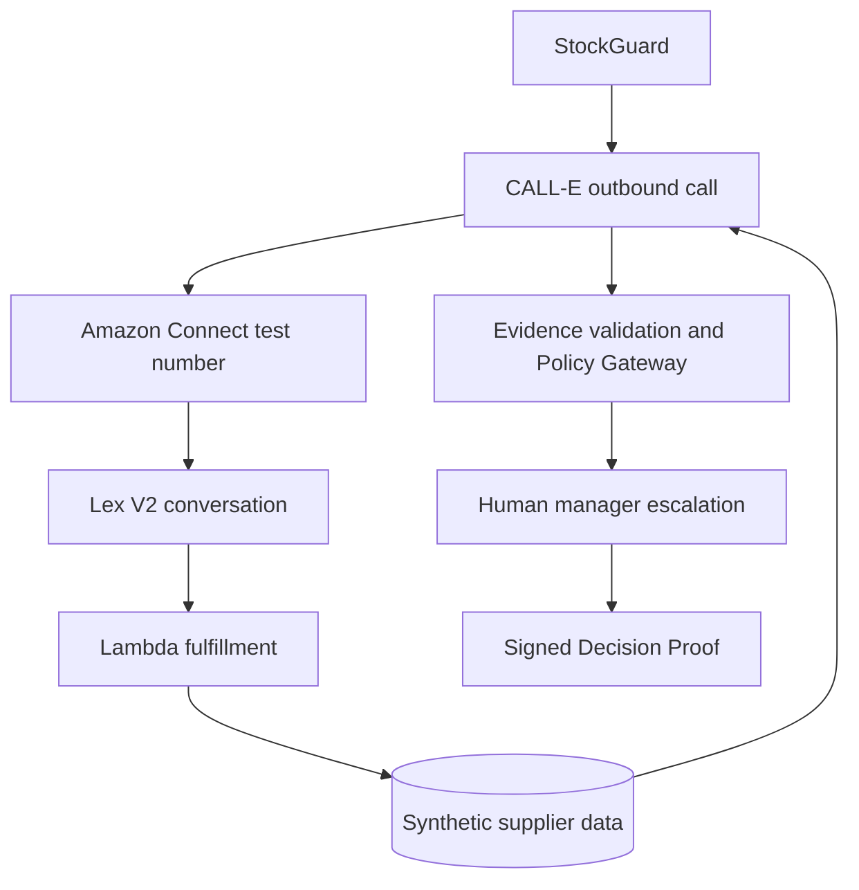

# Synthetic Supplier Simulator

## Purpose

The Amazon Connect Supplier Simulator is **a deterministic synthetic supplier test harness used to safely demonstrate real telephony integration**.

It is not presented as a production supplier system, evidence that real suppliers use bots, or the business value of StockGuard. In a real deployment, CALL-E would contact a person, sales desk, company IVR or existing supplier telephony system when current inventory and pricing are not available through an API or EDI connection.

Every organization, supplier, RFQ, SKU, price and order used by the harness is fictional or synthetic.

## End-to-end demonstration

The supplier calls and manager escalation share one StockGuard `runId`. The RFQ is the correlation key across CALL-E metadata, Connect session attributes, Lambda lookup, structured result, rule trace, audit chain and Decision Proof.

## Runtime classification

| Label | Meaning |
|---|---|
| `Mock Mode` | No PSTN call; deterministic local adapters exercise the same domain contracts |
| `Synthetic Supplier Simulator` | Controlled Amazon Connect/Lex/Lambda counterparty using fictional data |
| `Live CALL-E Call` | A real CALL-E runtime request and PSTN call; disabled until credentials and safeguards are configured |
| `Recorded CALL-E Evidence` | CALL-E structured result and field evidence; a mock preview is never labelled as live evidence |
| `Human Manager Escalation` | One consented, bounded call to the judge after every offer is rejected |

The public GitHub Pages sandbox remains independent of CALL-E and AWS availability.

## One-number multilingual routing

A PSTN call does not carry the intended synthetic supplier locale. The one-number design therefore uses two explicit stages:

1. CALL-E states a short synthetic RFQ code in the routing locale `en_GB`.
2. The `IdentifySyntheticRfq` intent resolves the approved RFQ and profile.
3. Lambda returns `targetLocale` in Lex session attributes.
4. The Connect flow branches on `targetLocale`.
5. A **Set voice** block sets the matching language attribute.
6. Connect invokes the same versioned Lex V2 bot/alias in `de_DE`, `fr_FR` or `pl_PL`.
7. The localized bot handles the quote and follow-up intents.

This avoids an unsupported assumption that Connect automatically detects the supplier language. An unknown RFQ, profile mismatch, unexpected bot/alias or locale closes the synthetic conversation without returning quote data.

Amazon Lex V2 currently lists German `de_DE`, French `fr_FR` and Polish `pl_PL` as supported locales. Amazon Connect requires its language attribute to match the Lex V2 language model. These capabilities were checked on 2026-08-21 against the official [Lex V2 locale list](https://docs.aws.amazon.com/lexv2/latest/dg/how-languages.html) and [Connect–Lex setup guide](https://docs.aws.amazon.com/connect/latest/adminguide/amazon-lex.html).

## Deterministic profiles

Default values scale from the requested quantity, so the same mechanism works for an 8-unit UI demo and a 1,000-unit qualification call.

| Profile | Locale | Default state | Deterministic result | Expected rule outcome |
|---|---|---|---|---|
| `DE_SUPPLIER` | `de_DE` | `PARTIAL_STOCK` | 70% available now; remainder three days after the deadline | `quantity_sufficient = FAIL` |
| `FR_SUPPLIER` | `fr_FR` | `LATE_DELIVERY` | 120% available; delivery eight days after the deadline | `delivery_before_stockout = FAIL` |
| `PL_SUPPLIER` | `pl_PL` | `CHANGED_PAYMENT_TERMS` | 100% available before stockout; payment changed to advance payment | `commercial_terms_unchanged = REQUIRES_HUMAN` |

For a 1,000-unit RFQ, the German profile therefore returns 700 available units and 300 units after the required date.

The data layer supports controlled pre-test states:

- `AVAILABLE`
- `PARTIAL_STOCK`
- `OUT_OF_STOCK`
- `LATE_DELIVERY`
- `PRICE_CHANGED`
- `OFFER_EXPIRED`
- `CHANGED_PAYMENT_TERMS`

The state belongs to the Lambda data source, not a hard-coded Lex prompt. The current repository uses an in-memory store for tests. A future deployed adapter may use DynamoDB with versioned synthetic records and conditional updates.

## Lex intents and follow-up behavior

| Intent | Purpose |
|---|---|
| `IdentifySyntheticRfq` | Resolve the RFQ in `en_GB` and select the target locale |
| `GetSupplierQuote` | Return quantity, unit price, currency and delivery date |
| `CheckRemainingQuantity` | Answer whether the missing quantity can arrive before the deadline |
| `ConfirmOfferValidity` | Return the offer-valid-until timestamp |
| `ConfirmCommercialTerms` | Confirm unchanged terms or disclose the synthetic change |
| `EndConversation` | Close the controlled conversation |

The handler returns `ElicitIntent` after informational answers, so CALL-E can ask a follow-up rather than receiving one static announcement. Only `EndConversation` closes a successful localized exchange.

## Implemented safe contracts

`src/server/supplier-simulator` currently provides:

- typed synthetic profiles, RFQs, quotes, states and locales;
- a replaceable `SyntheticSupplierStore` port;
- deterministic state-to-quote generation;
- localized intent-specific answers;
- a two-stage Lex V2 handler contract;
- allowlists for bot ID, alias ID and locale;
- fail-closed behavior for disabled, unknown or mismatched context;
- `runId`, RFQ, profile and dataset-version propagation in session attributes;
- conversion into the existing mock CALL-E result path;
- automated tests for follow-ups, profile overrides, routing and default rejection causes.

The manager-escalation demo now obtains its three synthetic offers through this data service before passing them to the existing schema/evidence validation and deterministic Policy Gateway.

## Deployment guardrails

Before any live AWS/CALL-E test:

- deploy only one controlled Connect test number;
- associate only a versioned Lex alias, never a development/test alias for the final demo;
- allowlist the exact Connect instance, bot, alias and locales;
- keep a global simulator kill switch;
- use synthetic RFQs with short TTLs;
- cap concurrent and total CALL-E tasks;
- block unknown RFQs and profile mismatches;
- redact telephone numbers and transcripts from logs;
- use no real supplier names, prices, stock or orders;
- record explicit consent before the separate manager call;
- preserve the distinction between simulator responses and CALL-E evidence;
- create no purchase order from a telephone statement alone.

## Remaining live work

1. Define infrastructure as code for Connect, the versioned multi-locale Lex bot, Lambda and synthetic data storage.
2. Review the plan and estimated charges before deployment.
3. Create the controlled number only after explicit approval.
4. Connect CALL-E server-side and verify its exact webhook/authenticity mechanism.
5. Run one consented qualification call per locale, beginning with two locales.
6. Verify latency, speech recognition, interruption, follow-up, voicemail and timeout behavior.
7. Enable the manager call only after backend session, rate-limit, budget and kill-switch controls are active.

No AWS resource, telephone number, secret or real call is created by the current implementation.
